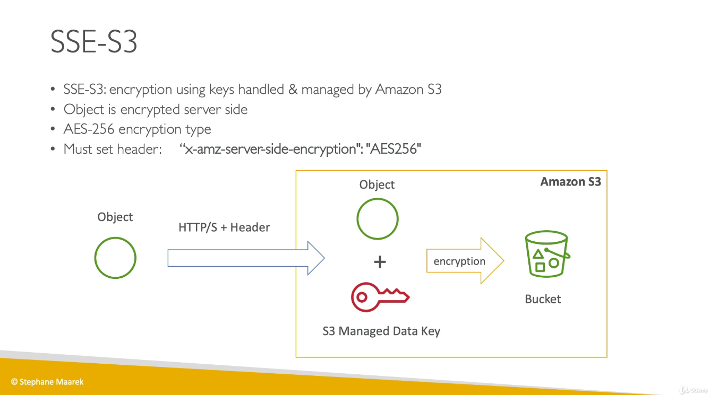
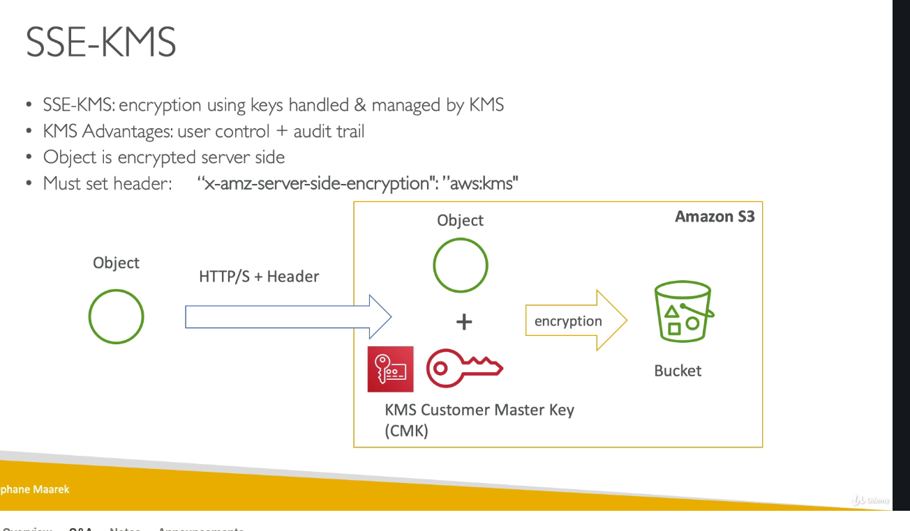
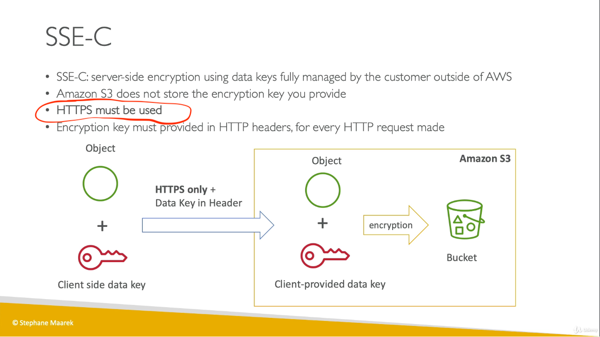
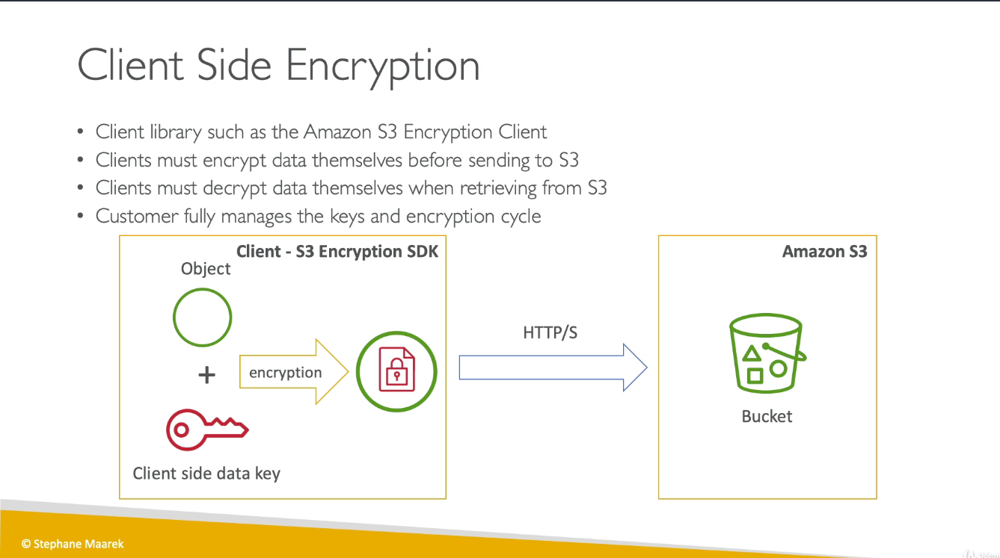

# IAM

## AWS has Global Services:
> Identity and Access Management (IAM)
>
> Route 53 (DNS service)
>
> CloudFront (Content Delivery Network) 
> 
> WAF (Web Application Firewall)

## IAM
> IAM = Identity and Access Management, Global service
> 
> Users or Groups can be assigned JSON documents called policies 
>
> These policies define the permissions of the users
> 
> In AWS you apply the least privilege principle: don’t give more permissions than a user needs


## IAM Roles for Services
> Some AWS service will need to perform actions on your behalf
>
> To do so, we will assign permissions to AWS services with IAM Roles
>
> Common roles:
> * EC2 Instance Roles
> * Lambda Function Roles
> * Roles for CloudFormation

## IAM Audit

Audit: IAM Credential Reports & IAM Access Advisor

# EC2-SG-SSH

## Overview
EC2 mainly consists in the capability of : 
> • Renting virtual machines (EC2)
> 
> • Storing data on virtual drives (EBS)
> 
> • Distributing load across machines (ELB)
>
> • Scaling the services using an auto-scaling group (ASG)

## Instance Type

AWS has the following naming convention:
```sh
  m5.2xlarge
```
>
> 5: generation (AWS improves them over time)
> 
> m: instance class
> 
> 2xlarge: size within the instance class

## Security Group
> They control how traffic is allowed into or out of our EC2 Instances.
>
> Security groups only contain rules
> 
> Security groups rules can reference by IP or by security group

## Security Group good to know

> Can be attached to multiple instances
> 
> Locked down to a region / VPC combination
> 
>Does live “outside” the EC2 – if traffic is blocked the EC2 instance won’t see it
> 
> *It’s good to maintain one separate security group for SSH access*
>
> If your application is not accessible (time out), then it’s a security group issue
> 
> If your application gives a “connection refused“ error, then it’s an application error or it’s not launched
> 
> All inbound traffic is *blocked* by default
> 
> All outbound traffic is *authorised* by default

Classic Ports to know
> * 22 = SSH (Secure Shell) - log into a Linux instance
> * 21 = FTP (File Transfer Protocol) – upload files into a file share
> * 22 = SFTP (Secure File Transfer Protocol) – upload files using SSH
> * 80 = HTTP – access unsecured websites
> * 443 = HTTPS – access secured websites
> * 3389 = RDP (Remote Desktop Protocol) – log into a Windows instance

## SSH doesn't work on Window machine which has < Windows 10 

## NAT(Network address translation)

Translates Private IPs to Public IPs and vice versa

## SSH to EC2

> 1. chmod 0400 EC2Tutorial.pem
> 2. ssh -i EC2Tutorial.pem ec2-user@35.180.101.414

# EBS-EFS-Instance Store

## Overview

* An EBS (Elastic Block Store) Volume is a network drive you can attach to your instances while they run
* It allows your instances to persist data, even after their termination
* They can only be mounted to one instance at a time (at the CCP level)
* They are bound to a specific availability zone
* It can be detached from an EC2 instance and attached to another one quickly. However, **it’s locked to an Availability Zone (AZ), so an EBS Volume in us-east-1a cannot be attached to us-east-1b**
* Can copy EBS snapshots across AZ or Region

## AMI

AMI = Amazon Machine Image

## EC2 Instance Store
* EBS volumes are network drives with good but “limited” performance
* If you need a high-performance hardware disk, use EC2 Instance Store
* Better I/O performance
* EC2 Instance Store lose their storage if they’re stopped (ephemeral)
* Good for buffer / cache / scratch data / temporary content
* Risk of data loss if hardware fails
* Backups and Replication are your responsibility
* Reference: https://docs.aws.amazon.com/AWSEC2/latest/UserGuide/InstanceStorage.html

## EFS - Elastic File System

* Managed NFS (network file system) that can be mounted on many EC2 
* EFS works with EC2 instances in **multi-AZ**
* Highly available, scalable, expensive (3x gp2), pay per use
* Compatible with Linux based AMI (not Windows)

# ELB-ASG

## ELB security group

User <----> Load Balancer <-----> EC2

* Load Balancer Security Group: HTTP:80 / HTTPS:443
* Application Security Group: Allow traffic only from Load Balancer

## Application Loader Balance
Routing tables to different **target groups**:
* Routing based on path in URL (example.com/users & example.com/posts)
* Routing based on hostname in URL (one.example.com & other.example.com)
* Routing based on Query String, Headers (example.com/users?id=123&order=false)
* ALB can route to multiple target groups
*   - www -> Route/user-> ALB -> Target Group for Users application
*   - www -> Route/search-> ALB -> Target Group for Search application
* **Health checks are at the target group level**

## Network Load Balancer (v2)

* NLB has one static IP per AZ, and supports assigning Elastic IP (helpful for whitelisting specific IP)

## Sticky Sessions – Cookie Names

Application-based Cookies
> Custom cookie
>   * Generated by the target
>   * Can include any custom attributes required by the application
>   * Cookie name must be specified individually for each target group
>   * Don’t use AWSALB, AWSALBAPP, or AWSALBTG (reserved for use by the ELB)
> 
> Application cookie
>   * Generated by the load balancer 
>   * Cookie name is AWSALBAPP

Duration-based Cookies
* Cookie generated by the load balancer
* Cookie name is AWSALB for ALB, AWSELB for CLB

## SSL – Server Name Indication (SNI)

* SNI solves the problem of loading multiple SSL certificates onto one web server (to serve multiple websites)
* It’s a “newer” protocol, and requires the client to indicate the hostname of the target server in the initial SSL handshake
* The server will then find the correct certificate, or return the default one
* Only works for ALB & NLB (newer generation), CloudFront
* Does not work for CLB (older gen)

## ELB – Connection Draining

Feature naming:
* CLB:ConnectionDraining
* TargetGroup:DeregistrationDelay
(for ALB & NLB)

## Auto Scaling Alarms

* **It is possible to scale an ASG based on CloudWatch alarms**
* An Alarm monitors a metric (such as Average CPU)
* Metrics are computed for the overall ASG instances
* Based on the alarm:
> * We can create scale-out policies (increase the number of instances) 
> * We can create scale-in policies (decrease the number of instances)

## ASG Rules

It is now possible to define ”better” auto scaling rules that are directly managed by EC2
* Target Average CPU Usage
* Number of requests on the ELB per instance 
* Average Network In
* Average Network Out

## Auto Scaling Groups – Predictive Scaling

Predictive scaling: continuously forecast load and schedule scaling ahead

## Target Group vs ASG

Target groups are just a group of Ec2 instances. Target groups are closely associated with ELB and not ASG.

* ELB -> TG - > Group of Instances

We can just use ELB and Target groups to route requests to EC2 instances. With this setup, there is no autoscaling which means instances cannot be added or removed when your load increases/decreases.

* ELB -> TG -> ASG -> Group of Instances

If you want autoscaling, you can attach a TG to ASG which in turn gets associated to ELB. Now with this setup, you get request routing and autoscaling together. Real world usecases follow this pattern. If you detach the target group from the Auto Scaling group, the instances are automatically deregistered from the target group

# RDS-Aurora-ElastiCache

RDS is a managed service:
* Automated provisioning, OS patching
* Continuous backups and restore to specific timestamp (Point in Time Restore)! 
* Monitoring dashboards
* Read replicas for improved read performance
* Multi AZ setup for DR (Disaster Recovery)
* Maintenance windows for upgrades
* Scaling capability (vertical and horizontal) 
* Storage backed by EBS (gp2 or io1)
* **BUT you can’t SSH into your instances**

RDS – Storage Auto Scaling

RDS Read Replicas for read scalability
* Applications must update the connection string to leverage read replicas

RDS Multi AZ (Disaster Recovery)
* SYNC replication
* One DNS name – automatic app
failover to standby

RDS Security - Encryption
* At rest encryption (AWS KMS)
> * Encryption at rest:
>   * Is done only when you first create the DB instance
>   * or: unencrypted DB => snapshot => copy snapshot as encrypted => create DB from snapshot
* In-flight encruption (SSL)

RDS Security – Network & IAM
* Network (scurity group)
* Access Management (IAM-based authentication)

RDS - IAM Authentication
* IAM database authentication works with
* You don’t need a password, just an authentication token obtained through IAM & RDS API calls
* Auth token has a lifetime of 15 minutes
* Benefits:
> * Network in/out must be encrypted using SSL
> * IAM to centrally manage users instead of DB
> * Can leverage IAM Roles and EC2 Instance profiles for easy integration

## Aurora

* Aurora is “AWS cloud optimized” and ***claims 5x performance improvement over MySQL on RDS, over 3x the performance of Postgres on RDS***
* Failover in Aurora is instantaneous. It’s HA (High Availability) native.
* Aurora costs more than RDS (20% more) – but is more efficient
* Support for Cross Region Replication
* Possibility to authenticate using IAM token (same method as RDS)

## ElastiCache

* ElastiCache is to get managed Redis or Memcached
* ***Using ElastiCache involves heavy application code changes***

## ElastiCahe - Cache security

* All caches in ElastiCache:
> * Do not support IAM authentication
> * IAM policies on ElastiCache are only used for AWS API-level security

Redis AUTH
> * You can set a “password/token” when you
create a Redis cluster
> * This is an extra level of security for your cache (on top of security groups)
> * Support SSL in flight encryption

## Caching strategy

Refer: https://aws.amazon.com/caching/best-practices/

## Lazy caching

You should apply a lazy caching strategy anywhere in your app where you have data that is going to be read often, but written infrequently. In a typical web or mobile app, for example, a user's profile rarely changes, but is accessed throughout the app. A person might only update his or her profile a few times a year, but the profile might be accessed dozens or hundreds of times a day, depending on the user. Popular technologies that are used for caching like Memcached and Redis will automatically evict the less frequently used cache keys to free up memory if you set an eviction policy. Thus you can apply lazy caching liberally with little downside.

## Write-through
In a write-through cache, the cache is updated in real time when the database is updated. So, if a user updates his or her profile, the updated profile is also pushed into the cache. You can think of this as being proactive to avoid unnecessary cache misses, in the case that you have data that you absolutely know is going to be accessed. A good example is any type of aggregate, such as a top 100 game leaderboard, or the top 10 most popular news stories, or even recommendations. Because this data is typically updated by a specific piece of application or background job code, it's straightforward to update the cache as well.

As might be obvious, you can combine lazy caching with write-through caching to help address these issues, because they are associated with opposite sides of the data flow. Lazy caching catches cache misses on reads, and write-through caching populates data on writes, so the two approaches complement each other. For this reason, it's often best to think of lazy caching as a foundation that you can use throughout your app, and write-through caching as a targeted optimization that you apply to specific situations.

## Cache (almost) everything
```sh
Finally, it might seem as if you should only cache your heavily hit database queries and expensive calculations, but that other parts of your app might not benefit from caching. In practice, in-memory caching is widely useful, because it is much faster to retrieve a flat cache key from memory than to perform even the most highly optimized database query or remote API call. Just keep in mind that cached data is stale data by definition, meaning there may be cases where it’s not appropriate, such as accessing an item’s price during online checkout. You can monitor statistics like cache misses to see whether your cache is effective.
```

# Route53

* Route53 is a Managed DNS (Domain Name System)
* DNS is a collection of rules and records which helps clients understand how to reach a server through URLs.
* In AWS, the most common records are: 
> * A: hostname to IPv4
> * AAAA: hostname to IPv6
> * CNAME: hostname to hostname
> * Alias: hostname to AWS resource.

DNS Records TTL(Time to live)
* TTL is mandatory for each DNS record

## CNAME
* Points a hostname to *any other hostname* (app.mydomain.com => blabla.anything.com) 
* ONLY FOR NON ROOT DOMAIN (like->something.mydomain.com)

## Alias
* Points a hostname to an *AWS Resource* (app.mydomain.com => blabla.amazonaws.com)
* Works for ROOT DOMAIN and NON ROOT DOMAIN (like->mydomain.com)
* Free of charge
* Native health check

## Weighted Routing Policy
* Control the % of the requests that go to specific endpoint
* Helpful to test 1% of traffic on new app version for example
* Helpful to split traffic between two regions
* Can be associated with Health Checks

## Domain Registrar != DNS

# VPC

## Overview
* VPC: private network to deploy your resources (regional resource)
* Subnets allow you to partition your network inside your VPC (Availability Zone resource)
* A public subnet is a subnet that is accessible from the internet
* A private subnet is a subnet that is not accessible from the internet
* To define access to the internet and between subnets, we use Route Tables.

## internet gateway & NAT gateways
* Internet Gateways helps our VPC instances connect with the internet
* Public Subnets have a route to the internet gateway.
* NAT Gateways (AWS-managed) & NAT Instances (self-managed) allow your instances in your Private Subnets to access the internet while remaining private


## NACL (Network ACL)
- A firewall which controls traffic from and to
subnet
- Can have ALLOW and DENY rules
- Are attached at the Subnet level
- Rules only include IP addresses
- Security Groups
- A firewall that controls traffic to and from an

## ENI / an EC2 Instance
- Can have only ALLOW rules
- Rules include IP addresses and other security groups

## VPC Peering
- Connect two VPC, privately using AWS’ network
- Make them behave as if they were in the same network
- Must not have overlapping CIDR (IP address range)
- VPC Peering connection is not transitive (must be established for each VPC that need to communicate with one another)

## others
- VPC Endpoints: Provide private access to AWS Services within VPC
    - VPC Endpoint Gateway: S3 & DynamoDB
    - **VPC Endpoint Interface (ENI)**: the rest
- VPC Flow Logs: network traffic logs
- Site to Site VPN: VPN over public internet between on-premises DC and AWS 
- Direct Connect: direct private connection to a AWS

# S3

## Buckets
* Amazon S3 allows people to store objects (files) in “buckets” (directories) 
* Buckets must have a globally unique name
* Buckets are defined at the region level

## objects
* Objects (files) have a Key
* The key is the FULL path:
    * s3://my-bucket/my_file.txt
    * s3://my-bucket/my_folder1/another_folder/my_file.txt
* The key is composed of prefix + object name
    * s3://my-bucket/my_folder1/another_folder/my_file.txt

## Versioning
* You can version your files in Amazon S3
* It is enabled at the **bucket level**
* Same key overwrite will increment the “version”: 1, 2, 3....
* It is best practice to version your buckets
    * Protect against unintended deletes (ability to restore a version) 
    * Easy roll back to previous version

## **S3 Encryption for Objects**
- There are 4 methods of encrypting objects in S3
    - SSE-S3: encrypts S3 objects using keys handled & managed by AWS
    - SSE-KMS: leverage AWS Key Management Service to manage encryption keys 
    - SSE-C: when you want to manage your own encryption keys
    - Client Side Encryption









## Encryption in flight is also called SSL /TLS

## Security

-  an IAM principal can access an S3 object if
    - the user IAM permissions allow it *OR* the resource policy ALLOWS it
    - *AND* there’s no explicit DENY

## Bucket policy
- JSON based policies
    - Resources: buckets and objects
    - Actions: Set of API to Allow or Deny
    - Effect: Allow / Deny
    - Principal:The account or user to apply the policy to
- Use S3 bucket for policy to:
    - Grant public access to the bucket
    - Force objects to be encrypted at upload
    - Grant access to another account (Cross
Account)

## CORS - Explained
- An origin is a scheme (protocol), host (domain) and port
    - E.g.: https://www.example.com (implied port is 443 for HTTPS, 80 for HTTP)
- CORS means Cross-Origin Resource Sharing
- Web Browser based mechanism to allow requests to other origins while visiting the main origin
- Same origin: http://example.com/app1 & http://example.com/app2
- Different origins: http://www.example.com & http://other.example.com
- The requests won’t be fulfilled unless the other origin allows for the requests, using CORS Headers (ex: Access-Control-Allow-Origin)

# CLI-SDK-IAM Policies

## Developing and performing AWS tasks against AWS can be done in several ways
- Using the AWS CLI on our local computer
- Using the AWS CLI on our EC2 machines
- Using the AWS SDK on our local computer
- Using the AWS SDK on our EC2 machines
- Using the AWS Instance Metadata Service for EC2

## Some AWS CLI commands (not all) contain a --dry-run option to simulate API calls

## Exponential Backoff (any AWS service)
- If you get ThrottlingException intermittently, use exponential backoff
- Retry mechanism already included in AWS SDK API calls
- Must implement yourself if using the AWS API as-is or in specific cases
- Must only implement the retries on 5xx server errors and throttling
- Do not implement on the 4xx client errors

## AWS CLI Credentials Provider Chain 
The CLI will look for credentials in this order:
1. Command line options – --region, --output, and --profile
2. Environment variables – AWS_ACCESS_KEY_ID, AWS_SECRET_ACCESS_KEY, and AWS_SESSION_TOKEN
3. CLI credentials file –aws configure
~/.aws/credentials on Linux / Mac & C:\Users\user\.aws\credentials on Windows
4. CLI configuration file – aws configure
~/.aws/config on Linux / macOS & C:\Users\USERNAME\.aws\config on Windows
5. Container credentials – for ECS tasks
6. Instance profile credentials – for EC2 Instance Profiles

## AWS Credentials Best Practices
- If using working within AWS, use IAM Roles • => EC2 Instances Roles for EC2 Instances
    - => ECS Roles for ECS tasks
    - => Lambda Roles for Lambda functions
- If working outside of AWS, use environment variables / named profiles

# Advanced S3

## S3 Replication (CRR & SRR)
- Must enable versioning in source and destination
- Cross Region Replication (CRR)
- Same Region Replication (SRR)
- Buckets can be in different accounts
- Copying is asynchronous
- Must give proper IAM permissions to S3
- CRR 
    - Use cases: compliance, lower latency access, replication across accounts
- SRR
    - Use cases: log aggregation, live replication between production and test accounts

## S3 Storage Classes
- Amazon S3 Standard - General Purpose
    - High durability (99.999999999%) of objects across multiple AZ
    - Use Cases: Big Data analytics, mobile & gaming applications, content distribution...
- Amazon S3 Standard-Infrequent Access (IA) 
    - High durability (99.999999999%) of objects across multiple AZs
    - Use Cases: As a data store for disaster recover y, backups...
- Amazon S3 One Zone-Infrequent Access
    - High durability (99.999999999%) of objects in a single AZ; data lost when AZ is destroyed
    - Use Cases: Storing secondary backup copies of on-premise data, or storing data you can recreate
- Amazon S3 Intelligent Tiering
    - Automatically moves objects between two access tiers based on changing access patterns
    - Designed for durability of 99.999999999% of objects across multiple Availability Zones
- Amazon Glacier - 3 retrieval options:
    - Expedited (1 to 5 minutes)
    - Standard (3 to 5 hours)
    - Bulk (5 to 12 hours)
    - Minimum storage duration of 90 days
- Amazon Glacier Deep Archive
    - Standard (12 hours)
    - Bulk (48 hours)
    - Minimum storage duration of 180 days

For infrequently accessed object, move them to STANDARD_IA

For archive objects you don’t need in real-time, GLACIER or DEEP_ARCHIVE

## S3 Lifecycle Rules – Scenario 1
- Your application on EC2 creates images thumbnails after profile photos are uploaded to Amazon S3.These thumbnails can be easily recreated, and only need to be kept for 45 days.The source images should be able to be immediately retrieved for these 45 days, and afterwards, the user can wait up to 6 hours. How would you design this?
```sh
S3 source images can be on STANDARD, with a lifecycle configuration to transition them to GLACIER after 45 days.

S3 thumbnails can be on ONEZONE_IA, with a lifecycle configuration to expire them (delete them) after 45 days.
```

## S3 Lifecycle Rules – Scenario 2
• A rule in your company states that you should be able to recover your deleted S3 objects immediately for 15 days, although this may happen rarely. After this time, and for up to 365 days, deleted objects should be recoverable within 48 hours.
```sh
You need to enable S3 versioning in order to have object versions, so that “deleted objects” are in fact hidden by a “delete marker” and can be recovered

You can transition these “noncurrent versions” of the object to S3_IA

You can transition afterwards these “noncurrent versions” to
DEEP_ARCHIVE
```

## Athena
- Serverless service to perform analytics directly against S3 files
- Exam Tip: Analyze data directly on S3 => use Athena
- Use cases: Business intelligence / analytics / reporting, analyze & query VPC Flow Logs, ELB Logs, CloudTrail trails, etc...

# CloudFront

AWS CloudFront
- Content Delivery Network (CDN)
- Improves read performance, content is cached at the edge
- 216 Point of Presence globally (edge locations)
- DDoS protection, integration with Shield, AWS Web Application Firewall
- Can expose external HTTPS and can talk to internal HTTPS backends

S3 bucket
- For distributing files and caching them at the edge
- Enhanced security with CloudFront **Origin Access Identity (OAI)**
- CloudFront can be used as an ingress (to upload files to S3)


Clients -> edge location (clopudfront distribution web) -> Origin (s3, server, ALB, EC2,ect..)

An origin is the location where content is stored, and from which CloudFront gets content to serve to viewers.

## Using Amazon S3 Origins, MediaPackage Channels, and Custom Origins for Web Distributions
When you create a distribution, you specify where CloudFront sends requests for the files. CloudFront supports using several AWS resources as origins. For example, you can specify an Amazon S3 bucket or a MediaStore container, a MediaPackage channel, or a custom origin, such as an Amazon EC2 instance or your own HTTP web server.

## CloudFront vs S3 Cross Region Replication 
- CloudFront:
    - Global Edge network
    - Files are cached for a TTL (maybe a day)
    - **Great for static content that must be available everywhere**
- S3 Cross Region Replication:
    - Must be setup for each region you want replication to happen
    - Files are updated in near real-time
    - Read only
    - **Great for dynamic content that needs to be available at low-latency in few regions**

S3 bucket “websites” don’t suppor t HTTPS

## cache


## CloudFront Signed URL Process 
- Two types of signers:
    - Either a trusted key group (recommended)
    - Can leverage APIs to create and rotate keys (and IAM for API security)
    - In your CloudFront distribution, create one or more trusted key groups

## CloudFront – Origin Groups
- To increase high-availability and do failover
- Origin Group: one primary and one secondary origin
- If the primary origin fails, the second one is used

## CloudFront – Field Level Encryption

Usage:
- Specify set of fields in POST requests that you want to be encrypted (up to 10 fields)
- Specify the public key to encrypt them

# ECS

## Docker Containers Management
- To manage containers, we need a container management platform
- Three choices:
    - ECS: Amazon’s own platform
    - Fargate: Amazon’s own Serverless platform
    - EKS: Amazon’s managed Kubernetes (open source)

## ECS Clusters Overview
- ECS Clusters are logical grouping of EC2 instances
- EC2 instances run the **ECS agent (Docker container)**
- The ECS agents registers the instance to the ECS cluster
- The EC2 instances run a special AMI, made specifically for ECS

## ECS Task
* Tasks definitions are metadata in JSON form to tell ECS how to run a Docker Container
* It contains crucial information around:
* Image Name
* Port Binding for Container and Host
* Memory and CPU required
* Environment variables
* Networking information
* IAM Role
* Logging configuration (ex CloudWatch)

## ECS Service
- ECS Services help define how many tasks should run and how they should be run
- They ensure that the number of tasks desired is running across our fleet of EC2 instances.
- They can be linked to ELB / NLB / ALB if needed

## In ECS Cluster (created ASG at the same time) -> create ECS agent

## In ECS Cluster (created ASG at the same time) -> Task definition -> choose EC2 -> Add container

## In ECS Cluster (created ASG at the same time) -> create Service -> Config task definition -> EC2

## Fargate
- We don’t provision EC2 instances
- We just create task definitions, and AWS will run our containers for us

## Fargate creation 
- In ECS Cluster (created ASG at the same time) -> Select cluster template -> Powered by AWS Fargate -> 
- In Task definition -> Select FARGATE -> Attach docker image from ECR to this task definition
- In service -> link task -> VPC -> ALB -> xxx

## ECS IAM roles deep dive
- EC2 instance profile: Used by ECS agent
- ECS Task Role: Defined in the task definition 

## ECS Task Placement Strategies
- Binpack
- Random
- Spread

## ECS – Service Auto Scaling
- ECS Service Scaling (task level) ≠ EC2 Auto Scaling (instance level)
- Fargate Auto Scaling is much easier to setup (because serverless)

# Elastic Beanstalk

## Overview
- Elastic Beanstalk is a developer centric view of deploying an application on AWS

## Deployment Options for Updates
- All at once (deploy all in one go) – fastest, but instances aren’t available to serve traffic for a bit (downtime)
- Rolling: update a few instances at a time (bucket), and then move onto the next bucket once the first bucket is healthy
- Rolling with additional batches: like rolling, but spins up new instances to move the batch (so that the old application is still available)
- Immutable: spins up new instances in a new ASG, deploys version to these instances, and then swaps all the instances when everything is healthy

## Elastic Beanstalk Deployment Blue / Green
- Route 53 can be setup using weighted policies to redirect a little bit of traffic to the stage environment


## Elastic Beanstalk - Traffic Splitting
- canary testing
- New application version is deployed to a temporary ASG with the same capacity
- What is canary testing?
```sh
Canary Testing is a way to reduce risk and validate new software by releasing software to a small percentage of users. With canary testing, you can deliver to certain groups of users at a time. Also referred to as canary deployments, incremental, staged, or phased rollouts, canary releases are a best practice in devops and software development.

The origin of the phrase is from the phrase “Canary in the coal mine”, in which coal miners would bring a caged canary bird into the coal mine to detect if the level of toxic gas was too high. Since birds have a lower tolerance for toxic gases than humans, if the bird died it was an early warning for the miners to evacuate. In the context of software development, the outcome isn’t as gruesome, instead as software developers the goal is to quickly detect and resolve an issue with new software before it degrades everyone’s experience.
```

## Elastic Beanstalk Deployment Process
- Elastic Beanstalk will deploy the zip on each EC2 instance, resolve dependencies and start the application

## Elastic Beanstalk Under the Hood
- Under the hood, **Elastic Beanstalk relies on CloudFormation**
- CloudFormation is used to provision other AWS services (we’ll see later)
- Use case: you can define CloudFormation resources in your .ebextensions to provision ElastiCache, an S3 bucket, anything you want!

## Elastic Beanstalk Migration: Load Balancer
- After creating an Elastic Beanstalk environment, you cannot change the Elastic Load Balancer type (only the configuration)
- To migrate:
    1. create a new environment with the same configuration except LB (can’t clone)
    2. deploy your application onto the new environment
    3. perform a CNAME (hostnamne -> hostname) swap or Route 53 update

## RDS with elastic beanstalk
- The best for prod is to separately create an RDS database and provide our EB application with the connection string

## Beanstalk in Single Docker Container does not use ECS

## Elastic Beanstalk – Multi Docker Container

# CI/CD

code | Build -> Test | Deploy -> Privision
AWS CodeCommit | AWS Codebuild | AWS Elastic Beanstalk (CodeDeploy)

## AWS CodePipeline Artifacts 
- Each pipeline stage can create ”artifacts”
- Artifacts are passed stored in Amazon S3 and passed on to the next stage

## CodePipeline state changes happen in AWS CloudWatch Events, which
can in return create SNS notifications.
- Ex: you can create events for failed pipelines 
- Ex: you can create events for cancelled stages

## codeDeploy
- If a roll back happens, CodeDeploy redeploys the last known good revision as a **new deployment**.

## CodeStar
- CodeStar is an integrated solution that regroups: GitHub, CodeCommit, CodeBuild, CodeDeploy, CloudFormation, CodePipeline, CloudWatch
- Helps quickly create “CICD-ready” projects for EC2, Lambda, Beanstalk

## CloudFormation
- Infrastructure as code
- No resources are manually created, which is excellent for control • The code can be version controlled for example using git
- Changes to the infrastructure are reviewed through code

## What are resources?
- Resources are the core of your CloudFormation template (MANDATORY)
- They represent the different AWS Components that will be created and configured
- Resources are declared and can reference each other

## How to Reference a Parameter
- The Fn::Ref function can be leveraged to reference parameters
- Parameters can be used anywhere in a template.
- The shorthand for this inYAML is !Ref
- The function can also reference other elements within the template

## What are mappings?
- Mappings are fixed variables within your CloudFormation Template.

## Cross Stack Reference
- We then create a second template that leverages that security group
- For this, we use the Fn::ImportValue function
- You can’t delete the underlying stack until all the references are deleted too.