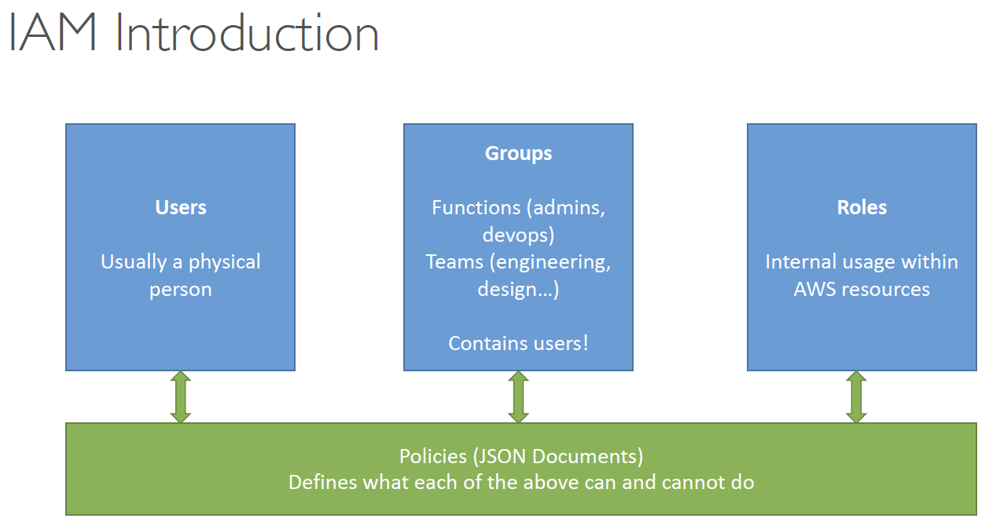
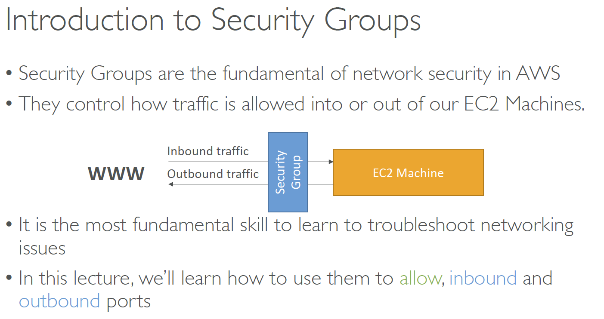
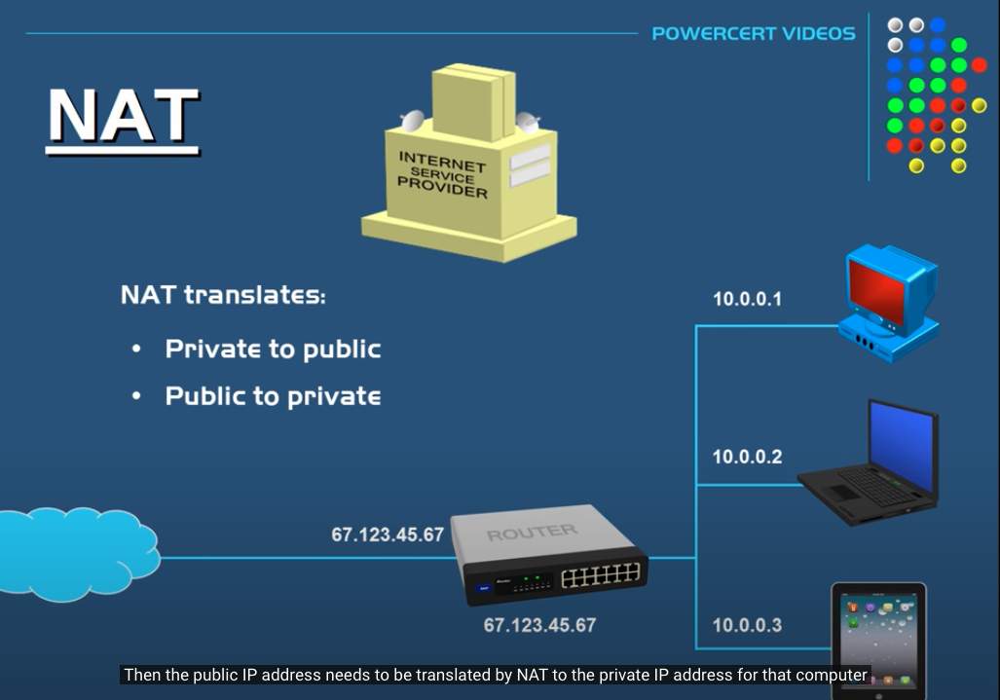

## Section3_IAM+EC2+ENI+IP
__Regions__

__Availability Zones__

> Each region has many availability zones(usually 3, min is 2, max is 6).

__IAM(Identity and Access Management)__

*Introduction*


> IAM has a global view

> Permissions are governed by Policies (JSON)

> It’s best to give users the minimal amount of permissions they need to perform their job (least privilege principles)

> One IAM User per PHYSICAL PERSON

> One IAM Role per Application

> IAM credentials should NEVER BE SHARED

__EC2__

*What host is right for me?*

> On demand
> - coming and staying in resort
whenever we like, we pay the full price
> 
> Reserved
> - like planning ahead and if we plan to
stay for a long time, we may get a good
discount
> 
> Spot instances
> - the hotel allows people to bid
for the empty rooms and the highest bidder
keeps the rooms. You can get kicked out at any
time
>
> Dedicated Hosts
> - We book an entire building
of the resort

*EC2 Pricing*

> EC2 instances prices (per hour) varies based on these parameters:
> - Region you’re in
> - Instance Type you’re using
> - On-Demand vs Spot vs Reserved vs Dedicated Host
> - Linux vs Windows vs Private OS (RHEL, SLES, Windows SQL)
>
> You are billed by the second, with a `minimum of 60 seconds.`
> 
> You also pay for other factors such as storage, data transfer, fixed IP public addresses, load balancing
> 
> You do `not` pay for the instance if the instance is `stopped`

__Security Group__

Security Groups are the fundamental of network security in AWS
and they control how traffic is allowed into or out of our EC2 Machines.

*Inbound/Outbound traffic*


> They regulate: 1.Access to Ports 2.Authorised IP ranges – IPv4 and IPv6 3.Control of inbound network (from other to the instance) 4.Control of outbound network (from the instance to other)"
>
> `It’s good to maintain one separate security group for SSH access`
>
> If your application is not accessible (time out), then it’s a security group issue
> 
> If your application gives a “connection refused“ error, then it’s an application error or it’s not launched
> 
> All inbound traffic is blocked by default
>
> All outbound traffic is authorised by default

__IPV4_IPV6__

*Public IP*
> Public IP means the machine can be identified on the internet (WWW)
>
> Must be unique across the whole web (not two machines can have the same public IP).
> 
> Can be geo-located easily

*Private IP*

> Private IP means the machine can only be identified on a private network only
>
> The IP must be unique across the private network
> 
> BUT two different private networks (two companies) can have the same IPs.
> 
> Machines connect to WWW using a `NAT` + internet gateway (a proxy)
> 
> Only a specified range of IPs can be used as private IP

*NAT(Network address translation)*
> Translates Private IPs to Public IPs and vice versa


*Elastic IPs - Try to avoid using Elastic IP*
```
When you stop and then start an EC2 instance, it can change its public IP. If you need to have a fixed public IP for your instance, you need an Elastic IP. An Elastic IP is a public IPv4 IP you own as long as you don’t delete it.
```

*Launch EC2*
```
By default, your EC2 machine comes with:
• A private IP for the internal AWS Network
• A public IP, for the WWW.

When we are doing SSH into our EC2 machines:
• We can’t use a private IP, because we are not in the same network
• We can only use the public IP.

If your machine is stopped and then started, the public IP can change
```

__ENI(Elastic Network Interfaces)__

ENI is a logical component in a VPC that represents a
virtual network card

*Diagram*


