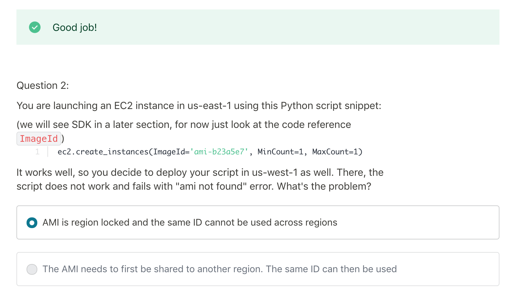
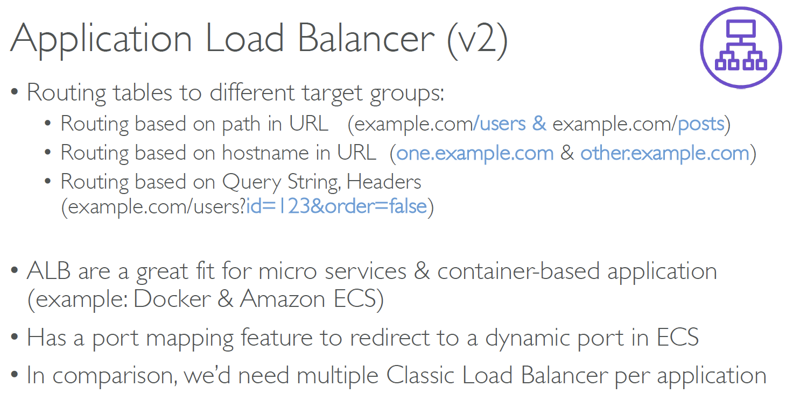
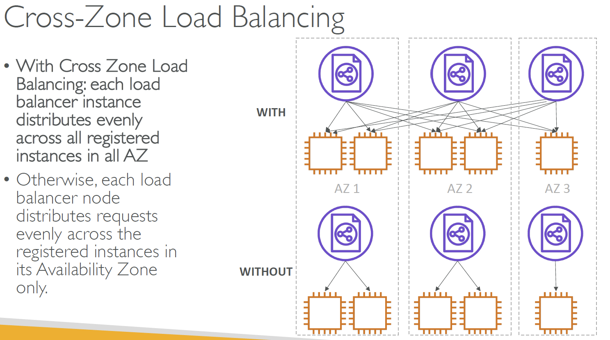

## Section3_IAM+EC2+ENI+IP
__Regions__

__Availability Zones__

> Each region has many availability zones(usually 3, min is 2, max is 6).

__IAM(Identity and Access Management)__

*Introduction*

> IAM has a global view

> Permissions are governed by Policies (JSON)

> It’s best to give users the minimal amount of permissions they need to perform their job (least privilege principles)

> One IAM User per PHYSICAL PERSON

> One IAM Role per Application

> IAM credentials should NEVER BE SHARED

__EC2__

*What host is right for me?*

> On demand
> - coming and staying in resort
whenever we like, we pay the full price
> 
> Reserved
> - like planning ahead and if we plan to
stay for a long time, we may get a good
discount
> 
> Spot instances
> - the hotel allows people to bid
for the empty rooms and the highest bidder
keeps the rooms. You can get kicked out at any
time
>
> Dedicated Hosts
> - We book an entire building
of the resort

*EC2 Pricing*

> EC2 instances prices (per hour) varies based on these parameters:
> - Region you’re in
> - Instance Type you’re using
> - On-Demand vs Spot vs Reserved vs Dedicated Host
> - Linux vs Windows vs Private OS (RHEL, SLES, Windows SQL)
>
> You are billed by the second, with a `minimum of 60 seconds.`
> 
> You also pay for other factors such as storage, data transfer, fixed IP public addresses, load balancing
> 
> You do `not` pay for the instance if the instance is `stopped`

__Security Group__

Security Groups are the fundamental of network security in AWS
and they control how traffic is allowed into or out of our EC2 Machines.

*Inbound/Outbound traffic*

> They regulate: 1.Access to Ports 2.Authorised IP ranges – IPv4 and IPv6 3.Control of inbound network (from other to the instance) 4.Control of outbound network (from the instance to other)"
>
> `It’s good to maintain one separate security group for SSH access`
>
> If your application is not accessible (time out), then it’s a security group issue
> 
> If your application gives a “connection refused“ error, then it’s an application error or it’s not launched
> 
> All inbound traffic is blocked by default
>
> All outbound traffic is authorised by default

__IPV4_IPV6__

*Public IP*
> Public IP means the machine can be identified on the internet (WWW)
>
> Must be unique across the whole web (not two machines can have the same public IP).
> 
> Can be geo-located easily

*Private IP*

> Private IP means the machine can only be identified on a private network only
>
> The IP must be unique across the private network
> 
> BUT two different private networks (two companies) can have the same IPs.
> 
> Machines connect to WWW using a `NAT` + internet gateway (a proxy)
> 
> Only a specified range of IPs can be used as private IP

*NAT(Network address translation)*
> Translates Private IPs to Public IPs and vice versa

*Elastic IPs - Try to avoid using Elastic IP*
> When you stop and then start an EC2 instance, it can change its public IP. If you need to have a fixed public IP for your instance, you need an Elastic IP. An Elastic IP is a public IPv4 IP you own as long as you don’t delete it.

*Launch EC2*
> By default, your EC2 machine comes with:
> - A private IP for the internal AWS Network
> - A public IP, for the WWW.
>
> When we are doing SSH into our EC2 machines:
> - We can’t use a private IP, because we are not in the same network
> - We can only use the public IP.
>
> If your machine is stopped and then started, the public IP can change

__ENI(Elastic Network Interfaces)__

ENI is a logical component in a VPC that represents a
virtual network card

*Diagram*

__AMI_is_Region_Locked__

## Section4_ELB+ASG+Scalability
__High Availability & Scalability For EC2__
> Vertical Scaling: Increase instance size (= scale up / down)
> - From: t2.nano - 0.5G of RAM, 1 vCPU
> - To: u-12tb1.metal – 12.3 TB of RAM, 448 vCPUs
>
> Horizontal Scaling: Increase number of instances (= scale out / in)
> - Auto Scaling Group
> - Load Balancer
>
> High Availability: Run instances for the same application across multi AZ (at least 2 AZs)
> - Auto Scaling Group multi AZ
> - Load Balancer multi AZ

__Load Balancer__

> Spread load across multiple downstream instances
>
> Expose a `single point of access (DNS)` to your application
>
> Seamlessly handle failures of downstream instances
>
> Do regular health checks to your instances
>
> Provide SSL termination (HTTPS) for your websites
>
> Enforce stickiness with cookies
>
> High availability across zones
>
> Separate public traffic from private traffic

__Types of load balancer on AWS__

> AWS has 3 kinds of managed Load Balancers
> - Classic Load Balancer (v1 - old generation) – 2009
>   - HTTP, HTTPS, TCP
>
> - Application Load Balancer (v2 - new generation) – 2016
>   - HTTP, HTTPS, WebSocket
>
> - Network Load Balancer (v2 - new generation) – 2017
>   - TCP, TLS (secure TCP) & UDP
>
> Overall, it is recommended to use the newer / v2 generation load balancers as they
provide more features
>
> You can setup `internal` (private) or `external` (public) ELBs

__Application Load Balancer__

*ALB - HTTP Based Traffic(`Health checks are at the target group level`)

*Target Groups*
> EC2 instances (can be managed by an Auto Scaling Group) – HTTP
> 
> ECS tasks (managed by ECS itself) – HTTP
> 
> Lambda functions – HTTP request is translated into a JSON event
>
> IP Addresses – must be private IPs
> 
> ALB can route to `multiple target groups`
> 
> `Health checks are at the target group level`
>
> Fixed hostname (XXX.region.elb.amazonaws.com)
> 
> The application servers don’t see the IP of the client directly
> - The true IP of the client is inserted in the header X-Forwarded-For
> - We can also get Port (X-Forwarded-Port) and proto (X-Forwarded-Proto) EC2

__Network Load Balancer__
> Network load balancers (Layer 4) allow to:
> - Forward TCP & UDP traffic to your instances
> - Handle millions of request per seconds
> - Less latency ~100 ms (vs 400 ms for ALB)
> 
> NLB has `one static IP per AZ`, and `supports assigning Elastic IP`
(helpful for whitelisting specific IP)
> 
> NLB are used for extreme performance, TCP or UDP traffic
>
> Not included in the AWS free tier

__Cross-Zone Load Balancing__

*Cross-Zone load balancing - Three LB types*
> Classic Load Balancer
> - Disabled by default
> - No charges for inter AZ data if enabled
>
> Application Load Balancer
> - `Always on` (can’t be disabled)
> - No charges for inter AZ data
>
> Network Load Balancer
> - Disabled by default
> - You pay charges ($) for inter AZ data if enabled

__SSL/TLS__

An SSL Certificate allows traffic between your clients and your load balancer
to be encrypted in transit (in-flight encryption). The load balancer uses an X.509 certificate (SSL/TLS server certificate). You can manage certificates using ACM (AWS Certificate Manager).

*Server Name Indication(SNI)

__ASG(Auto Scaling Group)__

The goal of an Auto Scaling Group (ASG) is to:
> Scale out (add EC2 instances) to match an increased load
> 
> Scale in (remove EC2 instances) to match a decreased load
>
> Ensure we have a minimum and a maximum number of machines running
>
> Automatically Register new instances to a load balancer

*Auto Scaling Alarms*
> It is possible to scale an ASG based on `CloudWatch` alarms
>
> An Alarm monitors a metric (such as Average CPU)
> 
> `Metrics are computed for the overall ASG instances`

Having instances under an ASG means that if they get terminated for whatever reason,
the ASG will automatically `create new ones as a replacement`. Extra safety!

*Scaling Policies*

Target Tracking Scaling
> Most simple and easy to set-up
>
> Example: I want the average ASG CPU to stay at around 40%

Simple / Step Scaling
> When a CloudWatch alarm is triggered (example CPU > 70%), then add 2 units
>
> When a CloudWatch alarm is triggered (example CPU < 30%), then remove 1
> 

Scheduled Actions
> Anticipate a scaling based on known usage patterns
>
> Example: increase the min capacity to 10 at 5 pm on Fridays

__Target Type of target groups__

The following are the possible target types:

1. instance
2. ip
3. lambda

__Sticky sessions for Application Load Balancer__

By default, an Application Load Balancer routes each request independently to a registered target based on the chosen load-balancing algorithm. However, you can use the sticky session feature (also known as session affinity) to enable the load balancer to bind a user's session to a specific target. This ensures that all requests from the user during the session are sent to the same target. This feature is useful for servers that maintain state information in order to provide a continuous experience to clients. To use sticky sessions, the client must support cookies.

Application Load Balancers support both duration-based cookies and application-based cookies. The key to managing sticky sessions is determining how long your load balancer should consistently route the user's request to the same target. Sticky sessions are enabled at the target group level. You can use a combination of duration-based stickiness, application-based stickiness, and no stickiness across all of your target groups.

The content of load balancer generated cookies are encrypted using a rotating key. You cannot decrypt or modify load balancer generated cookies.

For both stickiness types, the Application Load Balancer resets the expiry of the cookies it generates after every request. If a cookie expires, the session is no longer sticky and the client should remove the cookie from its cookie store.

__Target Group vs Auto scaling Group__

Target groups are just a group of Ec2 instances. Target groups are closely associated with ELB and not ASG.

> ELB -> TG - > Group of Instances

We can just use ELB and Target groups to route requests to EC2 instances. With this setup, there is no autoscaling which means instances cannot be added or removed when your load increases/decreases.

> ELB -> TG - > ASG -> Group of Instances

If you want autoscaling, you can attach a TG to ASG which in turn gets associated to ELB. Now with this setup, you get request routing and autoscaling together. `Real world usecases follow this pattern`. If you detach the target group from the Auto Scaling group, the instances are automatically deregistered from the target group