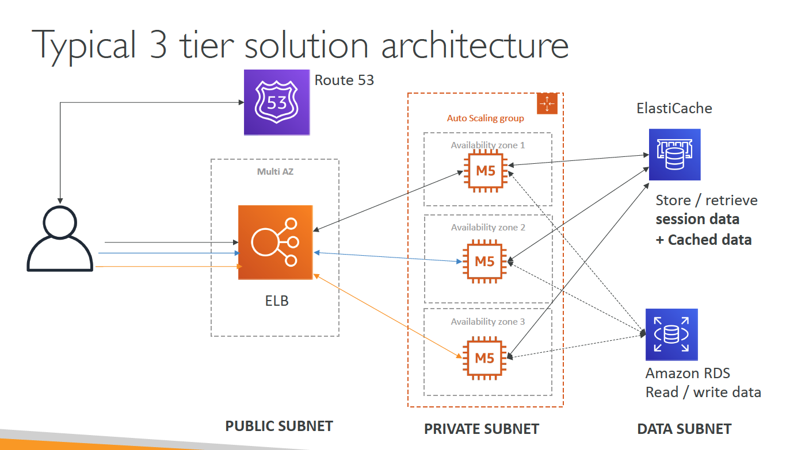

## Section4_IAM+AWS CLI
__IAM(Identity and Access Management)__

*Introduction*


> IAM has a global view
>
> Permissions are governed by Policies (JSON)
>
> It’s best to give users the minimal amount of permissions they need to perform their job (least privilege principles)
>
> One IAM User per PHYSICAL PERSON
>
> One IAM Role per Application
>
> IAM credentials should NEVER BE SHARED

*Users & Group*


*Permissions*


*Policy Structure*


*IAM Roles*

[Roles tutorial](https://www.youtube.com/watch?v=7sYE6J1_CsQ)

*IAM Roles for Services*

we're going to create what's called an IAM Role. So these IAM role will be just like a user, but they are intended to be used not by physical people, but instead they will be used by AWS ***services***. So what does that mean? It's a bit confusing. So for example,we are going to an EC2 Instance create throughout this course,An EC2 Instance is just like a virtual server,and we'll see this in the next section.But so this EC2 Instance may want to
perform some actions on AWS and to do so,we need to give permissions to our EC2 Instance. To do so, we're going to create an IAM Role and together
they're going to make one entity.And together, once the EC2 Instance is trying to access some information from AWS,then it will use the IAM Role.
And if the permission assigned to the IAM Role is correct,then we're going to get access to the call we are trying to make.


*IAM Guidelines & Best Practices*
> • Don’t use the root account except for AWS account setup
> 
> • One physical user = One AWS user
>
> • Assign users to groups and assign permissions to groups
> 
> • Create a strong password policy
> 
> • Use and enforce the use of Multi Factor Authentication (MFA)
> 
> • Create and use Roles for giving permissions to AWS services
> 
> • Use Access Keys for Programmatic Access (CLI / SDK)
> 
> • Audit permissions of your account with the IAM Credentials Report
>
> • Never share IAM users & Access Keys

*Summary*
> Users: mapped to a physical user, has a password for AWS Console
> 
> Groups: contains users only
> 
> Policies: JSON document that outlines permissions for users or groups
> 
> Roles: for EC2 instances or AWS services
> 
> Security: MFA + Password Policy
> 
> AWS CLI: manage your AWS services using the command-line
> 
> AWS SDK: manage your AWS services using a programming language
> 
> Access Keys: access AWS using the CLI or SDK
> 
> Audit: IAM Credential Reports & IAM Access Advisor

## Section5_EC2 Fundamentals
__Availability Zones__

> Each region has many availability zones(usually 3, min is 2, max is 6).

__EC2__
*EC2 User Data*
> It is possible to bootstrap our instances using an EC2 User data script. Bootstrapping means launching commands when a machine starts. That script is only run once at the instance first start

*EC2 instance types*

>AWS has the following naming convention:
>
>m5.2xlarge
> 
> • m: instance class
>
> • 5: generation (AWS improves them over time)
>
> • 2xlarge: size within the instance class

*Create an EC2 instance with EC2 User Data to have a website hands on*
> See Section5 folder -> 1.Create_EC2_1.png ~ 11.7_Install_apache_7_check_result_via_public_IP.png

__Security Group__

Security Groups are the fundamental of network security in AWS
and they control how traffic is allowed into or out of our EC2 Machines.

*Inbound/Outbound traffic*


> They regulate: 1.Access to Ports 2.Authorised IP ranges – IPv4 and IPv6 3.Control of inbound network (from other to the instance) 4.Control of outbound network (from the instance to other)"
>
> `It’s good to maintain one separate security group for SSH access`
>
> If your application is not accessible (time out), then it’s a security group issue
> 
> If your application gives a “connection refused“ error, then it’s an application error or it’s not launched
> 
> All inbound traffic is `blocked` by default
>
> All outbound traffic is `authorised` by default

*SecurityGroup Diagram*


*Referencing other security groups*


*Classic Ports*


__SSH__

*SSH EC2*
> See Section5 folder -> 7.1...png ~ 7.2...png

*SSH on Windows 10+*


*EC2 connect still needs SSH port 22 for security group*


__Access EC2 instance__

*Don't config AWS key and ID in EC2 instance and use IAM for EC2 instance access*
```
So we could indeed run aws configure to configure the credentials and specify an Access ID a Secret Access key, and a region name. But this is a really, really, really bad idea. And the reason is that if we run aws configure and enter our personal details onto this EC2 Instance, then anyone else in our accounts could again connect to our EC2 Instance. For example, using EC2 Instance Connect and retrieve the value of these credentials in our instance, which is not what we want.
This is something that's really, really bad. And so as a rule of thumb, never, ever, ever enter your IAM APA key.
```

*Access EC2 instance with IAM role*


__EC2 Instance Purchasing Options__


*What host is right for me?*

> On demand
> - coming and staying in resort
whenever we like, we pay the full price
> 
> Reserved
> - like planning ahead and if we plan to
stay for a long time, we may get a good
discount
> 
> Spot instances
> - the hotel allows people to bid
for the empty rooms and the highest bidder
keeps the rooms. You can get kicked out at any
time
>
> Dedicated Hosts
> - We book an entire building
of the resort

*EC2 Pricing*

> EC2 instances prices (per hour) varies based on these parameters:
> - Region you’re in
> - Instance Type you’re using
> - On-Demand vs Spot vs Reserved vs Dedicated Host
> - Linux vs Windows vs Private OS (RHEL, SLES, Windows SQL)
>
> You are billed by the second, with a `minimum of 60 seconds.`
> 
> You also pay for other factors such as storage, data transfer, fixed IP public addresses, load balancing
> 
> You do `not` pay for the instance if the instance is `stopped`


__IPV4_IPV6__

*Public IP*
> Public IP means the machine can be identified on the internet (WWW)
>
> Must be unique across the whole web (not two machines can have the same public IP).
> 
> Can be geo-located easily

*Private IP*

> Private IP means the machine can only be identified on a private network only
>
> The IP must be unique across the private network
> 
> BUT two different private networks (two companies) can have the same IPs.
> 
> Machines connect to WWW using a `NAT` + internet gateway (a proxy)
> 
> Only a specified range of IPs can be used as private IP

*NAT(Network address translation)*
> Translates Private IPs to Public IPs and vice versa


*Elastic IPs - Try to avoid using Elastic IP*
> When you stop and then start an EC2 instance, it can change its public IP. If you need to have a fixed public IP for your instance, you need an Elastic IP. An Elastic IP is a public IPv4 IP you own as long as you don’t delete it.

*Launch EC2*
> By default, your EC2 machine comes with:
> - A private IP for the internal AWS Network
> - A public IP, for the WWW.
>
> When we are doing SSH into our EC2 machines:
> - We can’t use a private IP, because we are not in the same network
> - We can only use the public IP.
>
> If your machine is stopped and then started, the public IP can change


__ENI(Elastic Network Interfaces)__

ENI is a logical component in a VPC that represents a
virtual network card

*Diagram*


__AMI_is_Region_Locked__


## Section6_EC2_Instance_Storage
__EBS__

An EBS (Elastic Block Store) Volume is a network drive you can attach
to your instances while they run and it allows your instances to persist data

It’s locked to an Availability Zone (AZ)
> An EBS Volume in us-east-1a cannot be attached to us-east-1b

*EBS Volumes come in 4 types*
> GP2 (SSD): General purpose SSD volume that balances price and performance for a wide variety of workloads -> `Development and test environments`
> 
> IO1 (SSD): Highest-performance SSD volume for mission-critical low-latency or highthroughput workloads -> `MongoDB, Cassandra, Microsoft SQL Server, MySQL, PostgreSQL, Oracle`
> 
> ST1 (HDD): Low cost HDD volume designed for frequently accessed, throughputintensive workloads -> `Streaming workloads requiring consistent, fast throughput at a low price\Big data, Data warehouses, Log processing\Apache Kafka\Cannot be a boot volume`
> 
> SC1 (HDD): Lowest cost HDD volume designed for less frequently accessed workloads -> `Scenarios where the lowest storage cost is important/Cannot be a boot volume`

__AMI__

Amazon Machine Image


__EFS(Elastic File System)__


> Use cases: content management, web serving, data sharing, Wordpress
>
> Uses security group to control access to EFS
>
> `Compatible with Linux based AMI (not Windows)`

*EBS VS EFS - Elastic Block Storage*


*EBS VS EFS - Elastic File System*


__EBS vs EFS vs Instance Storage__

```
And again, what you remember is that for EFS,you do get billed only for what you use on your EFS,whereas for EBS, you have to provision in advance a size that you know for EBS drive,and you pay for the provision capacity not the actual use capacity.So, now you should remember,EFS is really for a network file system to be mounted across multiple instances.EBS is for a network volume,then it should be mounted only on one instance and it is locked to an AZ.An Instance Store is to get the maximum amount of IO onto an EC2 instance,but is something you lose, if you lose that instance,so it is an ephemeral drive, okay.
```

## Section7_ELB+ASG
__High Availability & Scalability For EC2__
> Vertical Scaling: Increase instance size (= scale up / down)
> - From: t2.nano - 0.5G of RAM, 1 vCPU
> - To: u-12tb1.metal – 12.3 TB of RAM, 448 vCPUs
>
> Horizontal Scaling: Increase number of instances (= scale out / in)
> - Auto Scaling Group
> - Load Balancer
>
> High Availability: Run instances for the same application across multi AZ (at least 2 AZs)
> - Auto Scaling Group multi AZ
> - Load Balancer multi AZ

__EC2 should only be accessed from LB__

```
3.2_Set_EC2_Security_group_can_only_be_accessed_by_ELB_security_group.png
```

__Load Balancer__

> Spread load across multiple downstream instances
>
> Expose a `single point of access (DNS)` to your application
>
> Seamlessly handle failures of downstream instances
>
> Do regular health checks to your instances
>
> Provide SSL termination (HTTPS) for your websites
>
> Enforce stickiness with cookies
>
> High availability across zones
>
> Separate public traffic from private traffic

__Types of load balancer on AWS__

> AWS has 3 kinds of managed Load Balancers
> - Classic Load Balancer (v1 - old generation) – 2009
>   - HTTP, HTTPS, TCP
>
> - Application Load Balancer (v2 - new generation) – 2016
>   - HTTP, HTTPS, WebSocket
>
> - Network Load Balancer (v2 - new generation) – 2017
>   - TCP, TLS (secure TCP) & UDP
>
> Overall, it is recommended to use the newer / v2 generation load balancers as they
provide more features
>
> You can setup `internal` (private) or `external` (public) ELBs

__Application Load Balancer__


*ALB - HTTP Based Traffic(`Health checks are at the target group level`)


*Target Groups*
> EC2 instances (can be managed by an Auto Scaling Group) – HTTP
> 
> ECS tasks (managed by ECS itself) – HTTP
> 
> Lambda functions – HTTP request is translated into a JSON event
>
> IP Addresses – must be private IPs
> 
> ALB can route to `multiple target groups`
> 
> `Health checks are at the target group level`
>
> Fixed hostname (XXX.region.elb.amazonaws.com)
> 
> The application servers don’t see the IP of the client directly
> - The true IP of the client is inserted in the header X-Forwarded-For
> - We can also get Port (X-Forwarded-Port) and proto (X-Forwarded-Proto) EC2

__Network Load Balancer__
> Network load balancers (Layer 4) allow to:
> - Forward TCP & UDP traffic to your instances
> - Handle millions of request per seconds
> - Less latency ~100 ms (vs 400 ms for ALB)
> 
> NLB has `one static IP per AZ`, and `supports assigning Elastic IP`
(helpful for whitelisting specific IP)
> 
> NLB are used for extreme performance, TCP or UDP traffic
>
> Not included in the AWS free tier

__Cross-Zone Load Balancing__


*Cross-Zone load balancing - Three LB types*
> Classic Load Balancer
> - Disabled by default
> - No charges for inter AZ data if enabled
>
> Application Load Balancer
> - `Always on` (can’t be disabled)
> - No charges for inter AZ data
>
> Network Load Balancer
> - Disabled by default
> - You pay charges ($) for inter AZ data if enabled

__SSL/TLS__

An SSL Certificate allows traffic between your clients and your load balancer to be encrypted in transit (in-flight encryption). The load balancer uses an X.509 certificate (SSL/TLS server certificate). You can manage certificates using ACM (AWS Certificate Manager).

*Server Name Indication(SNI)


__ASG(Auto Scaling Group)__

The goal of an Auto Scaling Group (ASG) is to:
> Scale out (add EC2 instances) to match an increased load
> 
> Scale in (remove EC2 instances) to match a decreased load
>
> Ensure we have a minimum and a maximum number of machines running
>
> Automatically Register new instances to a load balancer

*Auto Scaling Alarms*
> It is possible to scale an ASG based on `CloudWatch` alarms
>
> An Alarm monitors a metric (such as Average CPU)
> 
> `Metrics are computed for the overall ASG instances`

Having instances under an ASG means that if they get terminated for whatever reason,
the ASG will automatically `create new ones as a replacement`. Extra safety!

*Scaling Policies*

Target Tracking Scaling
> Most simple and easy to set-up
>
> Example: I want the average ASG CPU to stay at around 40%

Simple / Step Scaling
> When a CloudWatch alarm is triggered (example CPU > 70%), then add 2 units
>
> When a CloudWatch alarm is triggered (example CPU < 30%), then remove 1
> 

Scheduled Actions
> Anticipate a scaling based on known usage patterns
>
> Example: increase the min capacity to 10 at 5 pm on Fridays

__Target Type of target groups__

The following are the possible target types:

1. instance
2. ip
3. lambda

__Sticky sessions for Application Load Balancer__

By default, an Application Load Balancer routes each request independently to a registered target based on the chosen load-balancing algorithm. However, you can use the sticky session feature (also known as session affinity) to enable the load balancer to bind a user's session to a specific target. This ensures that all requests from the user during the session are sent to the same target. This feature is useful for servers that maintain state information in order to provide a continuous experience to clients. To use sticky sessions, the client must support cookies.

Application Load Balancers support both duration-based cookies and application-based cookies. The key to managing sticky sessions is determining how long your load balancer should consistently route the user's request to the same target. Sticky sessions are enabled at the target group level. You can use a combination of duration-based stickiness, application-based stickiness, and no stickiness across all of your target groups.

The content of load balancer generated cookies are encrypted using a rotating key. You cannot decrypt or modify load balancer generated cookies.

For both stickiness types, the Application Load Balancer resets the expiry of the cookies it generates after every request. If a cookie expires, the session is no longer sticky and the client should remove the cookie from its cookie store.

__Target Group vs Auto scaling Group__

Target groups are just a group of Ec2 instances. Target groups are closely associated with ELB and not ASG.

> ELB -> TG - > Group of Instances

We can just use ELB and Target groups to route requests to EC2 instances. With this setup, there is no autoscaling which means instances cannot be added or removed when your load increases/decreases.

> ELB -> TG - > ASG -> Group of Instances

If you want autoscaling, you can attach a TG to ASG which in turn gets associated to ELB. Now with this setup, you get request routing and autoscaling together. `Real world usecases follow this pattern`. If you detach the target group from the Auto Scaling group, the instances are automatically deregistered from the target group


## Section9 Route53
__DNS Records TTL (Time to Live)__

TTL is mandatory for each DNS record

__Latency Routing Policy__
>Super helpful when latency of users is a priority
>
>Latency is evaluated in terms of user to designated AWS Region

## Section10 VPC

__Internet Gateway__

* It helps our VPC instances connect with the internet
* Public Subnets have a route to the
internet gateway.

`NAT Gateways (AWS-managed) &
NAT Instances (self-managed)` allow
your instances in your Private Subnets
to access the internet while remaining
private


__VPC Closing Comments__


__3 Tier solution architecture__


## Section11 S3

__Encryption in transit(SSL/TLS)__

* HTTPS is mandatory for SSE-C (server-side encryption using data keys fully managed by the customer outside of AWS)
* Encryption in flight is also called SSL/TLS


__Bucket Policies__

{
    "Version": "2020-10-17",
    "Statement": [
        {
            "Sid": "PublicRead",
            "Effect": "Allow",
            "Principal": "*"
        }
    ]
}

```
A principal is a person or application that can make a request for an action or operation on an AWS resource. The principal is authenticated as the AWS account root user or an IAM entity to make requests to AWS. As a best practice, do not use your root user credentials for your daily work. Instead, create IAM entities (users and roles). You can also support federated users or programmatic access to allow an application to access your AWS account.
```

*__Below content doesn't include hands-on screens. Needs to do later__*

## Section15_ECS,ECR & Fargate

*ECS task placement and constraints*

Steps:

- cluster -> task placement, then define strategy and constraint

*Auto Scaling*

Steps:

- cluster -> capacity provider -> create

- create new service -> add capacity provider -> placement(random) -> config Auto Scaling
-> choose IAM role ->  create

## Setion16 elastic beanstalk

*environment*

Steps:

- elastic beanstalk -> platform, then nodejs -> create application

- Select beanstalk env -> Events -> choose INFO -> s3, security group, elastic ip, ec2 instance created along with beanstalk

- beanstalk env for this application created -> beanstalk application created

- select application -> select env tier -> web server env -> enter appProd -> nodejs as platform -> configure more options -> modify software if you want -> load balancer can't be changed later on


*docker as beanstalk platform*

Steps: 

- Elastic Beanstalk -> applications -> environment -> platform, then docker, then multi-docker -> sample application 

- find website containing -> samples/docker-multicontainer-v2.zip

- Dockerrun.aws.json file is used to generate the ECS task definition

## Setion17 CICD

*codeCommit* like github

Steps:

- codeCommit -> create repo -> upload a file -> PR is merge feature branch to main branch

- create trigger for repo -> send SNS 


*Pipeline*

Steps:

- developer tools -> codePipeline -> pipelines -> create new pipelines

- Detection options: Use Amazon CloudWatch Events to automatically start my pipeline when a change occurs

- stages can have multiple action groups

- deploy stage in prod -> 1.manual approval -> 2.deploy to stage

*codebuild*

- buildspec.yml file must be at the root of your code

- To enable VPC, code build -> build projects -> MyBuildProject -> Edit Environment -> additional configuration


## Setion19 cloudwatch

***Exam Note:***

-  I said, the metric filter is ***not retroactive***. So we need to make this Metric Filter work, and for this, very simply, I'm gonna go into MyFirstBeanstalk-environment, and then I'm going to do an environment action,
and I went to restart the app servers, and this should trigger a lot more logs

- if you see CloudWatch Events or EventBridge, it's sort of the same thing except EventBridge will have some added capability, such as third-party Software as a Service applications and Custom event buses as well as Schema Registry.

- So a very common question is,"Hey, my X-Ray application works on my computer
when I test locally, but doesn't work on my EC2 machine.Why?" Well, the answer is probably because on your machine you're running the X-Ray daemon, but when you deploy it to your EC2 Instance, it's not running the X-Ray daemon and therefore, X-Ray doesn't see your calls.

- Now, very important.Annotations is when we add some key value pair data to index our traces and use with filters. So annotations is are extremely important in X-ray. If you want to be able to search your traces with new indexes versus metadata.

- Metadata is key value pairs, as well. But these this time they're not index. Okay, so your annotations are indexed and you can use them to search with filters, whereas metadata are not indexed and you cannot use them for searching.

- And the cool thing about it is that if you change your sampling rules in the X-Ray console, you don't have to restart your applications. You don't have to do anything with your X-Ray in SDK. Automatically the daemon, the extra daemon knows how to get visa something rules and correctly send the right amount of data into the X-Ray service.

- And so if you see x-ray read and write APIs at the exam, you should be prepared to know when to use which and why.

- Super simple to enable X-Ray with Beanstalk.Just click enable x-ray and EC2 instance will have x-ray IAM correspondingly.

- But remember, the take away from this slide is that you need to map the Container Port of the X-Ray Daemon to 2000 UDP. Then, you need to set an environment variable, called X-Ray Daemon address. And finally, you need to link these two containers from a networking standpoint.

- cloudTrail and cloudwatch hands-on tutorial are really good

- CloudWatch is really just for overall metrics, X-Ray is a lot more granular,
trace-oriented type of service and CloudTrail is going to be for auditing API calls.


## Setion20 SQS, SNS & Kinesis

***Exam Note:***

- Simple Notification Service

- Kinesis Data Streams (Collecting streaming data with a data stream)

- Kinesis Data Firehose (Process and deliver streaming data with data delivery stream)

- Kinesis Data Analytics (Analyze streaming data with data analytics application)

- Kinesis Client Library (KCL is a java library that helps read data from KDS)

- So anytime you see application decoupling in your exam, think about Amazon SQS.

- Why do we have dead letter queues? Well we have them for debugging.

- So why do we do Long Polling? Well, we do Long Polling because we are doing less API calls into the SQS Queue.

- So you will see in the exam some questions maybe telling you that the consumer is doing too many calls into the SQS Queue, and that is costing you money and CPU cycles, and maybe increasing the latency, then Long Polling is going to be the option.

-  we can have SQS FIFO queues as a subscribers of the FIFO SNS topic.

- We can set up an access policy and the excess policy is going to define who
and what can right to the SNS topics. So this is similar to an S3 bucket policy
and this is similar to also an SQS access to policy,

- Also, you need to make sure your partition key is very well distributed to avoid the concept of a hot partition, because then you will have one shard that's going to have more throughputs than the others and they will bring some imbalance.

- But if we start over-producing into a shard we're going to get an exception
because we are going over the provision throughput. So we get the ProvisionedThroughputExceeded exception. And so the solution to this is number one, to make sure you are using a highly distributed partition key because if not, then this error will happen a lot. And we need to implement retries with exponential backoff to ensure that we can retry these exceptions and this is something that comes up at the exam. And finally, you need to scale the shard,
maybe it's called shard-splitting to split a shard into and augment the throughputs

- So there're three kinds of destinations with Kinesis Data Firehose. The number one category is AWS destinatios and you need to know them by heart.
So the first one is Amazon S3.So you can write all your data into Amazon S3.
The second one is Amazon Redshift which is a warehousing database
and to do so it first writes the data into Amazon history and then Kinesis Data Firehose will issue a copy command and this copy command is going to copy data from Amazon history into Amazon Redshift and the last destination on AWS
is called Amazon ElasticSearch. There're also some third party partner destinations.So Kinesis Data Firehose can send data into Datadog, Splunk, New Relic, MongoDB and this list can get bigger and bigger over time.

- Write throughput: 1 MB/sec or 1000 records/sec per shard

- sometimes is going to be better to use SQS FIFO. If you want to have a dynamic number of consumers based on the number of group IDs, and sometimes it could be better to use Kinesis Data Stream if you have say 10,000 trucks and you need to send it lot of data, and also have data ordering per shard


## Setion21 Serverless: Lambda

***Exam Note:***

- So the exam, if they ask you to run a container on Lambda, unless that container does implement the Lambda runtime API, you will run to run that container on ECS or Fargate.

- it's usually very, very cheap to run your code on Lambda.

- So it's really cool because that means that as we have more load automatically Lambda will scale with our load. And that is a whole power
of using Lambda as a compute platform.

- lambda integration with ALB, then The Lambda function must be registered in a target group

- When you enable multi-value headers, HTTP headers and query string parameters that are sent with multiple values are shown as arrays within the
AWS Lambda event and response objects

- you can use Lambda@Edge: deploy Lambda functions alongside your CloudFront CDN to run a global lambda

- Eventbridge rule -> trigger every 1 hour -> Lambda function perform a task

- If you want to ensure that an event notification is sent for every successful write, you can enable versioning on your bucket.

- Kinesis Data Streams & DynamoDB Streams:
  -  One Lambda invocation per stream shard
  - If you use parallelization, up to 10 batches processed per shard simultaneously
  
- SQS Standard:
  - Lambda adds 60 more instances per minute to scale up
  - Up to 1000 batches of messages processed simultaneously

- SQS FIFO:
  - Messages with the same GroupID will be processed in order
  - The Lambda function scales to the number of active message groups

- AWS recommends you use destinations instead of DLQ now (but both can be used at the same time)

- And let's see let's refresh this. So yes, my S3-failure does not have any messages yet. And do you know why? You should know by now. But because S3 invoking my lambda function is an asynchronous type of invocation. Then if we go into the configuration remember, and go to the asynchronous invocation,
well we have two retry attempts that are going to be running. So these retry attempts are going to be run. And then once the retry attempts are run, then the destination will be invoked as a failure.

- When you use an event source mapping to invoke your function, Lambda
uses the execution role to read event data.

- resource-based policy

- lambda in vpc, then Lambda will create an ENI (Elastic
Network Interface) in your subnets by using AWSLambdaVPCAccessExecutionRole

- Deploying a Lambda function in a public subnet does not give it internet access or a public IP

- If your application is CPU-bound (computation heavy), increase RAM

-  any interval of an execution between zero seconds and 15 minutes is a good use case for Lambda. Anything above 15 minutes is not a good use case for Lambda. And is something maybe that's going to be better for fargate, ECS or EC2.

- /tmp directory to download a big file, Max size is 512MB

- Can set a “reserved concurrency” at the function level (=limit)

- what you get to remember out of this slide is that the concurrency limit applies to all the functions in your accounts, and so you have to be careful because if one function goes over the limit, it's possible that your other functions get throttled.

- Reserved and Provisioned Concurrency

- Upload the zip straight to Lambda if less than 50MB, else to S3 first

- cloudformation
    - Use the Code.ZipFile property
    - You cannot include function dependencies with inline functions

- If you update the code in S3, but don’t update S3Bucket, S3Key or S3ObjectVersion, CloudFormation won’t update your function

- Can create your own image as long as it implements the Lambda Runtime API

- Aliases cannot reference aliases

- We can define a “dev”, ”test”, “prod” aliases and have them point at different lambda versions

- Avoid using recursive code, never have a Lambda function call itself


## Setion22 DynamoDB

***Exam Note:***

- partition key, sort key

- Table must have provisioned read and write capacity units
    - Read Capacity Units (RCU): throughput for reads
    - Write Capacity Units (WCU): throughput for writes

- One write capacity unit represents one write per second for an item up
to 1 KB in size.

- we write 6 objects per second of 4.5 KB each
  - We need 6 * 5 = 30 WCU (4.5 gets rounded to the upper KB)

- One read capacity unit represents one strongly consistent read per second, or
two eventually consistent reads per second, for an item up to 4 KB in size.

- 10 strongly consistent reads per seconds of 6 KB each
  - We need 10 * 8 KB / 4 = 20 RCU (we have to round up 6 KB to 8 KB)

- And so if you get a question exam and it's saying "We need to wipe every day, a whole table, and delete all data, should you DeleteItem or DeleteTable?"
well, it is much better and much more cost-efficient to use DeleteTable and maybe recreate the table afterwards

- if you want to only get certain attributes in the results, you can use something called a ProjectionExpression. Super important. ProjectionExpression allows you to say what you want to retrieve out of DynamoDB if you don't want to retrieve the full item. And this helps you save in network bandwidth.


## =========================================================================
## Section6_RDS+Aurora+ElastiCache

__RDS(Relational Database Service)__

*Read Replicas*


*Read Replicas - use cases*


*Read Replicas - network cose*
> In AWS there’s a network cost when data goes from one AZ to another
>
> To reduce the cost, you can have your Read Replicas in the same AZ

*Disaster Recovery*


*RDS - Encryption*
> If the master is not encrypted, the read replicas cannot be encrypted
>
> SSL certificates to encrypt data to RDS in flight
> 
> Provide SSL options with trust certificate when connecting to database
>
> To enforce SSL:
> * PostgreSQL: rds.force_ssl=1 in the AWS RDS Console (Parameter Groups)
> * MySQL: Within the DB:
> GRANT USAGE ON *.* TO 'mysqluser'@'%' REQUIRE SSL;

*RDS - IAM Authentication*


*RDS Security Summary*
> Encryption at rest:
> * Is done only when you first create the DB instance
> * or: unencrypted DB => snapshot => copy snapshot as encrypted => create DB from snapshot
> 
> `Your responsibility:`
> * Check the ports / IP / security group inbound rules in DB’s SG
> * In-database user creation and permissions or manage through IAM
> * Creating a database with or without public access
> * Ensure parameter groups or DB is configured to only allow SSL connections
> 
> AWS responsibility:
> * No SSH access
> * No manual DB patching
> * No manual OS patching
> * No way to audit the underlying instance

__Aurora__
> Aurora is a proprietary technology from AWS (not open sourced)
> 
> Postgres and MySQL are both supported as Aurora DB (that means your
drivers will work as if Aurora was a Postgres or MySQL database)
> 
> Aurora is “AWS cloud optimized” and `claims 5x performance improvement
over MySQL on RDS, over 3x the performance of Postgres on RDS`
> 
> Aurora storage automatically grows in increments of 10GB, up to 64 TB.
> 
> Aurora can have 15 replicas while MySQL has 5, and the replication process
is faster (sub 10 ms replica lag)
> 
> Failover in Aurora is instantaneous. It’s HA (High Availability) native.
> 
> `Aurora costs more than RDS (20% more) – but is more efficient`
>
> Possibility to authenticate using IAM token (same method as RDS)

*Aurora Global Database (recommended)*
> 1 Primary Region (read / write)
>
> Up to 5 secondary (read-only) regions, replication lag is
less than 1 second
> 
> Up to 16 Read Replicas per secondary region
> 
> Helps for decreasing latency
> 
> Promoting another region (for disaster recovery) has an
RTO of < 1 minute

__Amazon ElastiCache__

> ElastiCache is to get managed Redis or Memcached
> 
> AWS takes care of OS maintenance / patching, optimizations, setup,
configuration, monitoring, failure recovery and backups
> 
> Using ElastiCache involves heavy application code changes

*DB Cache*


*Lazy locading/Cache-Aside/Lazy Population*


*Write Through - Add or Update cache when database is updated*


*Final words of wisdom*
> Lazy Loading / Cache aside is easy to implement and works for many
situations as a foundation, especially on the read side
>
> Write-through is usually combined with Lazy Loading as targeted for the
queries or workloads that benefit from this optimization
> 
> Setting a TTL is usually not a bad idea, except when you’re using Writethrough.Set it to a sensible value for your application
> 
> Only cache the data that makes sense (user profiles, blogs, etc…)
>
> Quote: `There are only two hard things in Computer Science: cache
invalidation and naming things`


## Note
> ./images folder has images used in note.md
>
> Each section mainly contains Hands-On tutorials and quiz questions
